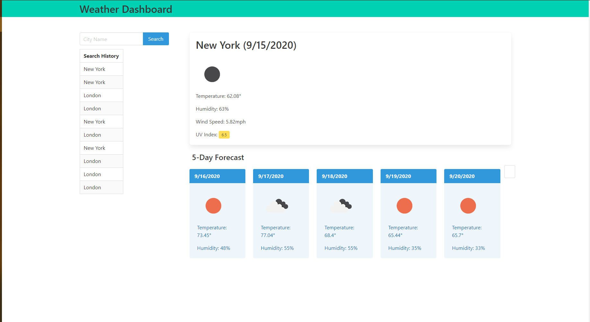

Weather Dashboard

This project is to generate a weather application using HTML, CSS, and Javascript to pull weather data from the OpenWeatherMap API and display the current weather for the searched city and a 5-day forecast. The application will store your search history and allow you to search from that history.

Page is available at https://michaelmayor.github.io/WeatherDashboard/

Screenshot 